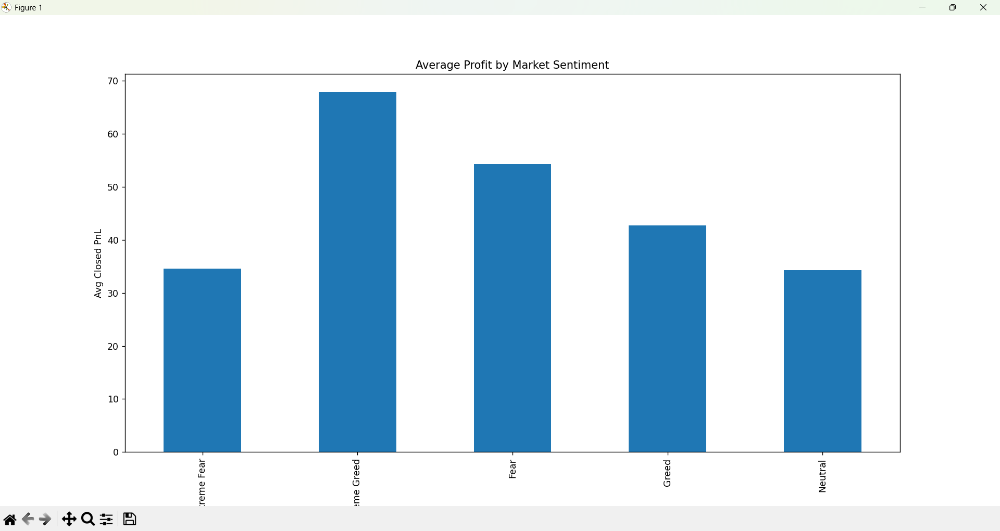

# Trader Behavior Insights Analysis

## 📌 Overview
This project analyzes the relationship between **market sentiment (Fear & Greed Index)** and **cryptocurrency trader performance**.

The goal is to uncover patterns in trading behavior and understand how sentiment influences profitability and risk-taking.

---

## 📊 Datasets Used
- Fear & Greed Index (Market Sentiment)
- Historical Trader Data (Hyperliquid)

---

## ⚙️ Key Analysis
- Merged sentiment data with trading activity using date
- Analyzed profit (Closed PnL) across sentiment categories
- Evaluated trade size behavior under different market conditions

---

## 📈 Key Insights

### 1. Profit vs Sentiment
- Highest profit during **Extreme Greed**
- Lowest during **Extreme Fear**
- Suggests strong market trends improve trader outcomes

### 2. Trade Size Behavior
- Larger trades during **Fear**
- Smaller trades during **Greed**
- Indicates cautious behavior in bullish markets

### 3. Behavioral Pattern
- Traders take higher risks during fear phases
- Market momentum during greed leads to better profitability

---

## 📉 Visualization

---

## 🧠 Conclusion
Market sentiment significantly impacts trading performance.  
Understanding sentiment can help design better trading strategies.

---

## 📂 Files
- `analysis.py` → Data analysis code
- `Trader_Behavior_Insights_Report.pdf` → Detailed insights
- `graph.png` → Visualization

---

## 🚀 Future Improvements
- Add machine learning models for prediction
- Analyze individual trader performance
- Incorporate more market indicators
